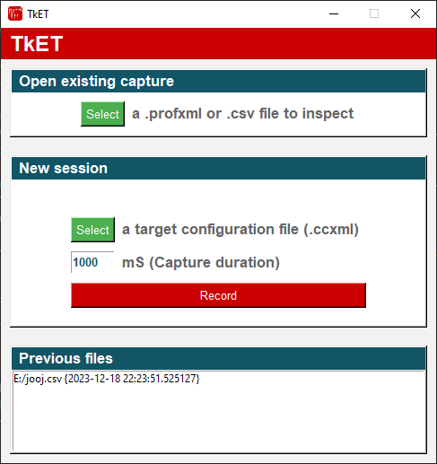

# TkET
Texas Instruments EnergyTrace™ viewer and recorder (stune.exe frontend).

## Requirements

- Python 3.11 or newer
- [Code Composer Studio](https://www.ti.com/tool/CCSTUDIO)
    - Only needed if planning on recording EnergyTrace sessions. Viewer works without it.

## TODO:

- Fix units (nA? nJ?)
- Settings menu
   - Select compression algorithm for arrays.
   - Pick CCS path from here.
- Cursors...
    - ...And the statistics that goes with it.
- Free unused EnergyTraceCapture objects from memory